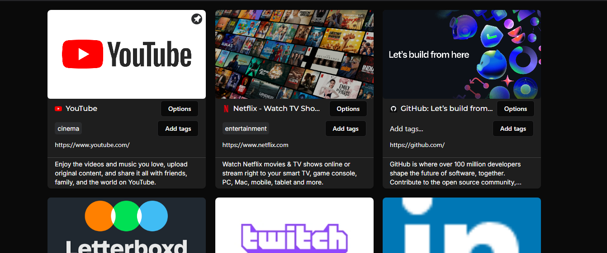

# Bookmark Manager App

**Bookmark Manager** is a web application designed to help users save, organize, and manage their bookmarks effortlessly. With easy tagging and fast searching, it provides a seamless experience for organizing your favorite websites.

## 🚀 Features

- **Add Bookmarks**: Save your favorite websites by simply entering the URL.
- **Tag Bookmarks**: Organize your bookmarks with custom tags for easy categorization.
- **Search & Filter**: Quickly filter or search bookmarks by tags or website titles.

## 🛠️ Tech Stack

- **Frontend**: React, Redux, Shadcn
- **Backend**: Node.js, Express
- **Database**: MongoDB
- **Deployment**: Vercel

